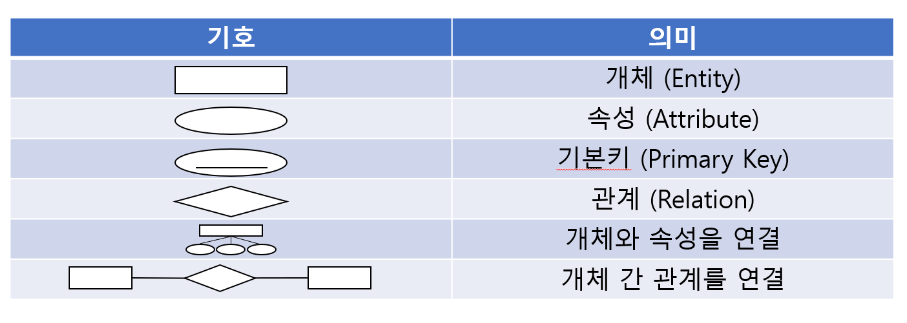
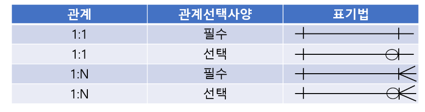

# 1주차 키워드 정리🎯

## 1. 외래키 (*Foreign Key*)
### 1) 외래키란?
- 외래키는 하나의 테이블에서 다른 테이블의 기본키를 참조하는키.
- 외래키는 데이터베이스에서 데이터 무결성(Integrity)을 유지하는데 중요한 역할을 한다.

### 2) 외래키의 이점
- **데이터 무결성 유지** : 외래키를 사용하면 데이터베이스에서 참조 무결성(Referential Integrity)을 유지할 수 있다. (만약, 자식 테이블의 레코드를 삭제하거나 업데이트할 때 부모 테이블의 기본키를 참조하지 않으면 데이터베이스에서 오류를 발생시킨다.)
- **데이터 일관성 유지** : 외래키를 사용하면 부모 테이블에서 레코드를 업데이트하거나 삭제할 때 자식 테이블에서도 일관성을 유지할 수 있다.
- **관계 정의** : 외래 키를 사용하면 데이터베이스에서 테이블 간의 관계를 정의할 수 있다. 이를 통해 두 개 이상의 테이블에서 데이터를 쉽게 검색하고 JOIN할 수 있다.

---

## 2. 기본키 (*Primary Key*)
### 1) 기본키란?
- 후보키들중 메인으로 선정되는 키로 후보키의 성질을 가진다.
- 유일성 + 최소성을 가짐. 해당 레코드를 식별시에 기준이 되는 반드시 필요한 키다.

### 2) 기본키의 조건
- 값의 변동이 잦은 후보키는 기본키로 부적절하다.
- NULL값을 가질 수 있는 속성이 포함된 후보키는 부적절하다.
- 후보키중 단순한 키를 기본키로 선택한다.
- 하나의 테이블에는 반드시 하나의 기본키만 존재한다.

---

## 3. ER 다이어그램 (*Entity Relation Diagram*)
### 1) ERD란?
ERD는 데이터베이스 구조를 한 눈에 알아보기 위해 그려놓는 다이어그램 (개체와 관계를 중점적으로 표시하는 다이어그램)

### 2) ERD 표기법
- 개체(Entity): 개체란 단독으로 존재하는 객체를 의미, 동일한 객체는 존재하지 않는다. ERD에서 개체를 사각형으로 표기한다.
- 속성(Attribute): 속성은 개체가 가지고 있는 속성을 의미한다. ERD에서 원으로 표기한다. 이 중 기본키는 속성에 밑줄을 그어 표기한다.
- 관계(Relationship): 관계는 개체 간의 관계를 의미한다. ERD에서 개체를 서로 이으며 어떤 관계를 가지는가에 대해 마름모로 표기한다.

---

## 4. 복합키 (*Composite key*)
### 1) 복합키란?
- 두개 이상의 컬럼을 묶어서 하나의 기본키로 지정하는것.
- 기본키는 하나의 테이블에 하나만 존재할 수 있고 하나 이상의 컬럼으로 구성되어 있다. → 기본키가 만약 복합키라면, 복합키 또한 당연히 유일성과 최소성을 만족해야한다.

---

## 5. 연관관계

### 1) 1:1 관계
- 하나의 엔티티가 다른 테이블의 엔티티 한 개와 연결된 경우이다.
- ❓ 왜 하나의 데이터베이스로 묶지 않을까?
    - 너무 많은 칼럼들이 있을 때 나누어 보관하기 위해 이용!
    - 보안상을 위해 민감한 정보를 보호할 때 이용!
- ex) 국가 - 수도, 사람 - 주민등록번호

### 2) 1:N 관계 (*일대다 관계*)
- 한 쪽 엔티티가 관계를 맺은 엔티티 쪽의 여러 객체를 가질 수 있는 경우이다.
- ex) 국가 - 도시, 부모 - 자식, 관리자- 직원

### 3) N:M 관계 (*다대다 관계*)
- 양쪽 엔티티 모두 1:N 관계가 존재할 때 나올 수 있는 경우, 즉 서로가 서로를 1:N 관계로 보고 있다.
- 두 테이블의 대표키를 컬럼으로 갖는 연결 테이블을 생성해서 관리한다.
- ex) 수업 - 학생, 현실에서 일어나는 흔한 관계는 보통 다대다이다.

---

## 6. 정규화
### 1) 정규화란?
- 정규화란 이상현상이 있는 릴레이션을 분해하여 이상현상을 없애는 과정이다. 이상현상이 존재하는 릴레이션을 분해하여 여러 개의 릴레이션을 생성하게 된다. 이를 구분하여 정규형이 높아질수록 이상현상은 줄어들게 된다.
- 즉, 쉽게말하면 테이블 간에 중복된 데이터를 허용하지 않는다는 것이다. 중복된 데이터를 허용하지 않음으로써 무결성(Integrity)를 유지할 수 있으며, DB의 저장 용량 역시 줄일 수 있다. 이러한 테이블을 분해하는 정규화 단계가 정의 되어 있다.

### 2) 정규화의 장점
- 데이터베이스 변경 시 이상 현상(Anomaly)을 제거할 수 있다.
- 정규화된 데이터베이스 구조에서는 새로운 데이터 형의 추가로 인한 확장 시, 그 구조를 변경하지 않아도 되거나 일부만 변경해도 된다.
- 데이터베이스와 연동된 응용 프로그램에 최소한의 영향만을 미치게 되어 응용프로그램의 생명을 연장시킨다.

### 3) 정규화의 단점
- 릴레이션의 분해로 인해 릴레이션 간의 JOIN연산이 많아진다.
- 질의에 대한 응답 시간이 느려질**수도**있다. 데이터의 중복 속성을 제거하고 결정자에 의해 동일한 의미의 일반 속성이 하나의 테이블로 집약되므로 한 테이블의 데이터 용량이 최소화되는 효과가 있다.
- 따라서 데이터를 처리할 때 속도가 빨라질 수도 있고 느려질 수도 있다.
- 만약 조인이 많이 발생하여 성능 저하가 나타나면 **반정규화(De-normalization)** 를 적용할 수도 있다.

### 4) 정규화 절차
1. 제1정규화
- 속성의 **원자성**을 확보한다.
  - 원자성?: 트랜잭션 실행은 모두 완료되거나, 실패 시 실행 이전으로 돌아가야한다.
  - 트랜직션?: DB 상태를 변화시키는 일련의 작업 단위이다.
- 속성의 중복값을 제거한다.
- 기본키(*Primary Key*)를 설정한다.

2. 제2정규화
- 기본키가 2개 이상의 속성으로 이루어진 경우, **부분 함수 종속성**을 제거(분해)한다.
    - 부분 함수 종속성?: 기본키가 2개 이상인 칼럼으로 이루어진 경우에만 발생한다. 기본키가 1개이면 이 과정을 넘어간다.
- 복합 인스턴스에 대해 각 인스턴스의 종속적 중복을 삭제한다.

3. 제3정규화
- 기본키를 제외한 칼럼간에 종속성을 제거한다 -> 이행 함수 종속성을 제거한다!
  - 이행 함수 종속?: 각각 X,Y,Z란 3개의 속성이 있을 때, X->Y,Y->Z이란 종속 관계가 있을 경우, X->Z가 성립될 때를 의미한다.
- 일반 속성의 종속성을 제거한다.

4. BCNF(더 제한적인 제3정규화)
- 기본키를 제외하고 후보키가 있는 경우, 후보키가 기본키를 종속시키면 분해한다.
- BCNF는 복수의 후보키가 있고, 후보키들이 **복합 속성**이어야 하며, 서로 **중첩**되어야 한다.

5. 제4정규화
- 여러 칼럼들이 하나의 칼럼을 종속시키는 경우, 분해하여 다중값 종속성을 제거한다.
- 다치 종속성을 제거한다.
  - 다치 종속성?: 관계 데이터베이스에서 관계 속성 간에 성립하는 종속성의 일종이다.
6. 제5정규화
- 조인에 의해서 종속성이 발생되는 경우 분해한다.

---

## 5) 반정규화(*De-normalization*)
### 1) 반정규화란?
- 데이터베이스의 성능 향상을 위하여, 데이터 중복을 허용하고 조인을 줄이는 데이터베이스 성능 향상 방법이다.
- 반정규화는**조회(select) 속도를 향상**시키지만, 데이터**모델의 유연성은 낮아**진다. 
- 
### 2) 그럼 반정규화를 왜 수행하는가?
- 정규화에 충실하여 종속성, 활용성은 향상 되었지만 수행속도가 느려진 경우
- 다량의 범위를 자주 처리해야하는 경우
- 특정 범위의 데이터만 자주 처리하는 경우
- 요약/집계 정보가 자주 요구되는 경우

### 3) 반정규화 절차
1. 대상 조사 및 검토 : 데이터 처리 범위, 통계성 프로세스, 테이블 조인 등을 확인합니다.
대량의 범위를 자주 처리하거나 특정 범위의 데이터만 자주 처리하는 경우를 파악합니다.
자주 요구되는 요약이나 집계 정보를 확인합니다.
2. 다른 방법 검토: 반정규화를 수행하기 전에 다른 방법을 먼저 고려합니다.
예를 들어, 뷰, 클러스터링, 인덱스 조정 등을 검토합니다.
    - 클러스트링? → 클러스터링 인덱스는 인덱스 정보를 저장할 때, 물리적으로 정렬해서 저장하는 방법이다. → 조회 시 인접 블록을 연속적으로 읽기 때문에 성능이 향상된다.
3. 반정규화 수행: 테이블, 속성, 관계 등을 반정규화합니다.

### 4) 개선된 반정규화 절차
1. **계산된 컬럼 추가**
- 배치 프로그램으로 총판매액, 평균잔고, 계좌평가를 미리 계산하고 그 결과를 특정 칼럼에 추가한다.

2. **테이블 수직 분할**

- 하나의 테이블의 두 개 이상의 테이블로 분할한다. 즉, 칼럼을 분할하여 새로운 테이블을 만드는 것이다.

3. **테이블 수평분할**

- 하나의 테이블에 있는 값을 기준으로 테이블을 분할하는 방법이다.