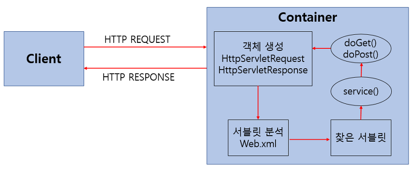

# 4주차 키워드 정리🎯

## DI
> ***의존대상 B가 변하면, 그것이 A에 영향을 미친다.*** - 이일민,토비의 스프링 3.1, 에이콘(2012), p113

### 의존성 주입(Dependency Injection)?
#### 1) 의존성?
- 객체 지향 프로그램에서 클래스나 모듈 간의 관계를 의미한다.
- 한 클래스가 다른 클래스에 의존한다는 것은 해당 클래스가 다른 클래스의 인스턴스나 메서드를 사용한다는 것을 의미한다.

#### 2) 의존성 주입?
- 의존성 주입은 객체 지향 프로그래밍에서 의존하는 객체를 직접 생성하거나 관리하지 않고 ***외부에서 주입받는 것***을 의미한다
- 즉, 의존성을 클래스 내부에서 생성하거나 결정하지 않고, 외부에서 주입받아 사용하는 방식이다
- 의존성 주입을 사용하면 클래스느 외부에서 주입받은 의존성 객체를 사용하므로, 의존성과 클래스 간의 결합도가 낮아지며 유연성과 재사용성이 향상된다.
- 객체 지향 설계 원칙 (SOILD)중 하나인 ***의존성 역전 원칙(DIP)을 따르는 것***이기도하다. `(DIP != DP)`

#### 3) Spring Boot 에서의 DI
- Spring Boot는 Maven OR Gradle을 사용하여 프로젝트의 의존성을 관리한다.
- Starter 패키지는 특정한 기능 또는 모듈을 포함한 의존성 집합으로, 간단하게 필요한 의존성을 추가할 수 있도록 도와준다.
- Spring Framework는 DI를 지원하여 의존성을 주입하는 다양한 방법을 제공한다.
  - `@Autowired` 어노테이션을 통해 의존성을 주입받을 수 있으며 생성자 주입, 세터 주입, 필드 주입등의 방식을 사용해 의존성을 주입할 수 있다.

#### 4) 생성자 주입 (Constructor Injection)
- 생성자를 통해 주입하는 방식이다.
- 인스턴스가 생성되었을 때 의존성이 존재하는 것이 보장되기 때문에, 의존성의 존재여부가 보장되고 의존성을 Immutable하게 정의 가능하다.
- ***Spring에서 권장하는 방식이다.***
- `클래스의 생성자가 1개일 경우` >> 그 생성자로 주입받을 객체가 `Bean`으로 등록되어 있다면, `@Autowired`를 생략할 수 있다.
```java
@Service
public class UserService {
    //final 붙이기 가능!
    private final UserRepository userRepository;
    
    // @Autowired (해당 예시 생략 가능)
    public UserService(UserRepository userRepository) {
        this.userRepository = userRepository;
    }
}
```

#### 5) 필드 주입(Field Injection)
- 필드에 의존관계를 주입하는 방법
- ***Intellij 사용시***, 필드 주입을 하면 `Field injection is not recommended`라는 경고 문구가 발생한다!
- 코드가 간결해지지만 ***외부에서 접근이 불가능하다는 단점***이 존재한다.

```java
@Service
public class UserService {
    @Autowired
    private UserService userService;
}
```

### 6) 수정자 주입(Setter Injection)
- 필드 값을 변경하는 setter를 통해 의존 관계를 주입하는 방법
- 생성자 주입과 다르게 주입받는 객체가 변경될 가능성이 있는 경우에 사용한다.

```java
private class UserService {
    private UserRepository userRepository;
    @Autowired
    pulic void setUserRepository(UserRepository userRepository) {
        this.userRepository = userRepository;
    }
}
```

### 7) 생성자 주입 방식의 장점
1. 순환 참조 방지
   - 순환 참조?: ***A 클래스가 B 클래스의 Bean을 주입받고, B 클래스가 A 클래스의 Bean을 주입받는 상황처럼 서로 순환되어 참조할 경우 발생되는 문제***
```java
@Service
public class AService {
    @Autowired
    private BService bService;
    
    public void helloA() {
        bService.helloB();
    }
}

public  class BService {
    @Autowired
    private AService aService;
    
    public void helloB() {
        aService.helloA();
    }
}

/*
        두 메소드는 서로를 계속하여 호출한다. -> StackOverflow Error가 발생한다.
        그러나 생성자 주입을 이용하면 어플리케이션 구동 시점(객체의 생성 시점)에 에러가 미리 발생한다
        =>> 이를 통해 서버 자체가 구동이 되지 않음을 알 수 있고 바로 순환참조를 방지할 수 있다.
        
        ?_? 그럼 진작에 Autowired를 이용한 필드 주입에서 어플리케이션 구동 시점에 에러가 발생해야 되지 않나요?
        =>> 빈의 생성과 조립(@Autowired) 시점이 분리되어 있기 때문에 에러가 발생되지 않는다.
        Autowired는 모든 객체의 생성이 완료된 후에 조립(의존관계 주입)이 처리된다.
        
        !_! 물론 스프링부트 2.6부터는 순환 참조가 기본적으로 허용되지 않도록 변경되었다.
        =>> 따라서 필드 주입을 받아도 순환 참조 발생시 애플리케이션 로딩 시점에 자동으로 에러가 발생한다.
 */
```

2. 테스트 용이
    - 테스트하고자 하는 클래스에 필드 주입이나 수정자 주입으로 빈이 주입되어 있으면, `Mockito`를 통해 목킹한 후 테스트를 진행해야한다.
    - `Mockito`? : Mock(진짜 객체 처럼 동작하지만 프로그래머가 직접 컨트롤 할 수 있는 객체)을 지원하는 프레임워크
    - ***BUT***, 생성자 주입의 경우 단순히 원하는 객체를 생성한 후 생성자에 넣어주면 끝이다.
    - 즉 생성자 주입을 사용시, ***주입의 대상이 되는 객체를 테스트 코드안에 직접 `new` 연산을 통해 주입될 객체를 생성할 수 있다는 장점이 있다.***

```java
@Service
public class UserService {
    @Autowired
    private UserRepository userRepository;
    
    public void register(String name) {
        userRepository.add(name);
    }
}

public class UserTest {
    @Test
    public void test() {
        UserService userService = new UserService();
        userService.register("mori");
    }
}
```
3. final 선언 가능 (불변성 보장)
    - 런타임에 객체 불변성을 보장한다.
    - 다른 주입 방법은 객체의 생성(생성자 호출) 이후에 호출되므로 final 키워드를 사용 X
    - ***생성자 주입을 통해 변경의 가능성 배제 + 불변성을 보장하는 것이 좋다***

4. 스프링에 비침투적인 코드 작성
    - 필드 주입을 사용하려면 @Autowired를 이용해야하는데, 이는 스프링의 어노테이션이다.
    - ***즉 @Autowired를 사용하면 UserService에 스프링 의존성이 침투한다.***

---

## IoC (Inversion of Control)
> ***Don’t call us, We’ll call you.*** - Hollywood principle

### 1) IoC란?
- ***IoC란 코드의 흐름을 제어하는 주체가 바뀌는 것이다.*** 
- 보통 프로그램은 오브젝트를 생성하는 것, 오브젝트의 생명 주기를 관리하는 것, 메소드를 수행하는 것 등등의 행위를 하나부터 열까지 모두 스스로 수행한다.
- IoC를 적용하는 것은 이런 흐름 제어를 또다른 ***제 3자가 수행한다는 것***을 의미한다.

### 2) Spring에서의 IoC?
- Spring은 IoC를 지원하기 위해 `ApplicationContext`라는 컨테이너를 제공한다.
- `ApplicationContext`는 어플리케이션의 컴포넌트를 생성하고 조립하며, 객체의 라이프사이클을 관리한다.
- ***Spring에서의 IoC 과정***
  - 1. 객체 생성 및 관리:`ApplicationContext`를 사용하여 빈을 생성하고 관리한다. 일반적으로 빈은 `Spring`이 제어하며, 개발자는 객체의 생성과 관리를 ***직접 처리하지 않는다.***
  - 2. 의존성 관리: 객체 간의 의존성을 Spring이 주입(DI)한다. 객체가 필요로 하는 다른 객체를 직접 생성하거나 찾는 대신, ***Spring 컨테이너가 의존성을 주입해주다.***
  - 3. 제어 흐름의 역전: 개발자가 코드의 제어 흐름을 결정하지 않고, 프레임워크가 객체의 라이프사이클 및 흐름을 관리한다. 

### 3) 그럼 DI나 IoC나 같은거 아닌가요? 😯
> ***DI IS NOT IoC.***
- IoC는 프로그램 제어권을 역전시키는 개념이고, DI는 ***해당 개념을 구현하기 위해 사용하는 디자인 패턴 중 하나***이다.
> As a result I think we need a more specific name for this pattern. Inversion of Control is too generic a term, and thus people find it confusing. As a result with a lot of discussion with various IoC advocates we settled on the name Dependency Injection.  
> 그 결과 이 패턴에 대해 좀 더 구체적인 이름이 필요하다고 생각한다. Inversion of Control은 너무 일반적인 용어이기 때문에 사람들은 그것을 혼동한다. 그 결과 다양한 IoC 옹호자들과 많은 논의를 거쳐 Dependency Injection이라는 이름을 정했다. - 마틴 파울러

### +) 프레임워크와 라이브러리의 차이: `IoC`
- 프레임워크(Framework)?: 소프트웨어의 특정 문제를 해결하기 위해서 상호 협력하는 클래스와 인터페이스의 집합
- 라이브러리(Library)?: 특정 기능에 대한 도구 or 함수들을 모은 집합
- 둘의 차이 IoC: 프레임워크는 전체적인 흐름을 ***자체적***으로 가지고 있고, 프로그래머가 그 안에 필요한 코드를 작성하는 반면에 라이브러리는 사용자가 흐름에 대해 제어를 하며 필요한 상황에만 가져다 쓰는 것이다.

---

## 프레임워크와 API의 차이
- 프레임워크(Framework)?: 소프트웨어의 특정 문제를 해결하기 위해서 상호 협력하는 클래스와 인터페이스의 집합
- API(Application Programming Interface)?: 정의 및 프로토콜 집합을 사용하여 두 소프트웨어 구성 요소가 서로 ***통신 할 수 있게 하는*** 매개체

### 예시를 통해 쉽게 이해할 수 없을까요? 😯
#### API
> - 어떤 사람이 음식점을 차렸습니다. 손님은 해당 음식점에서 주문을 하게됩니다.  
> - 손님은 메뉴판을 받지 못하였습니다. 그래서 손님은 원하는 음식을 아무거나 요청합니다.(예를 들어, 바다거북 스프..?)  
> - 손님은 또한 음식을 만드는 일련의 과정을 요청하였습니다. 그래서 그 레시피를 손님이 훔칠 생각 또한 합니다.

- 이런 일련의 과정을 당한 음식점 사장은 새로운 직원을 들여 홀을 담당합니다 :(

> - 홀을 담당하는 직원의 역할은 정해진 메뉴판을 보여주고, 그 안에서만 주문을 받게 합니다.  
> - 홀 직원은 주문을 음식점의 체계에 맞게 주문표로 만들어 주방에 보내줍니다.  
> - 주방에서 만들어진 음식은 홀 직원을 통해 보내고, 홀 직원은 해당 음식을 손님들에게 전달해줍니다.  
> - 홀 직원은 손님들의 부적절한 주방 접근을 제한하고 정해진 룰을 지켜주도록 합니다.

- ***여기서 홀 직원과 메뉴판을 API라고 생각하면 이해가 간결해집니다.***
- API는 요청과 응답을 사용하여 두 어플리케이션이 서로 통신하는 방법(메뉴판)입니다.
- 프로그래밍 관점에서 예를 들자면, 기상청의 데이터 베이스는 서버이고, 기상 정보 어플리케이션은 클라이언트입니다.
- 기상 정보 앱이 요청(메뉴)를 보내면 API는 데이터 베이스 시스템과 대화를 통해(주문표) 해당 날씨 정보(음식)를 앱에 표시합니다.
- 예를 들어 `Google Cloud Vision API`는 구글에서 제공하는 이미지 분석 API이다. 안쪽의 세세한 코드는 볼 수 없다.

#### Framework
> - 새로운 예비 사장님이 치킨집을 차리려고 합니다.  
> - 하지만 사장님은 이전에 중식집을 하셨던 분이라, 프라이드 치킨에 대한 지식이 전무합니다.  
> - 사장님은 치킨집을 꼭 차리고 싶었기에, 프랜차이즈 치킨집에 가맹 문의 연락을 합니다.
> - 프랜차이즈 치킨집에서는 해당 회사가 소유한 레시피나 비법에 대해 알려줍니다.
> - 물론 사장님의 중식 경력을 살려, 짜장 치킨같은 특별 메뉴도 추가하였습니다.

- ***여기서 프랜차이즈가 Framework라 생각하면 이해가 간결해집니다***
- 프랜차이즈를 통해 사장님이 치킨집을 차리듯이, ***개발자들이 애플리케이션을 개발하는 데 사용되는 구조를 프레임워크가 제공합니다.***
- 프랜차이즈의 룰, 인테리어와 치킨 레시피를 함부로 개인이 변경할 수 없고, 이를 따를시 짜장치킨 같은 특정 클라이언트가 만족할만한 서비스를 넣을 수 있습니다.
- `Spring` 또한 일련의 구조와 규칙이 있는 `java backend framework`라 할 수 있습니다.

---

## AOP (Aspect Oriented Programming)
### 1) AOP (관점 지향 프로그래밍)?
- 어떤 로직을 기준으로 핵심적인 관점, 부가적인 관점으로 나누어서 보고 그 관점을 기준으로 각각 모듈화하는 것을 의미한다.
- `모듈화`?: 어떤 공통된 로직이나 기능을 하나의 단위로 묶는 것을 말한다.

### 2) AOP 주요 개념
- `Aspect`: 흩어진 관심사를 모듈화 한 것. 주로 부가기능을 모듈화 한다.
- `Target`: `Aspect`를 적용하는 곳 (ex. Class, Method...)
- `Advice`: 실질적으로 어떤 일을 해야할 지에 대한 것, 실질적인 부가기능을 담은 구현체
- `JointPoint`: `Advice`가 적용될 위치, 끼어들 수 있는 지점. 메서드 진입 지점, 생성자 호출 시점, 필드에서 값을 꺼내올 때 등 다양한 시점에 적용가능하다.
- `PointCut`: `JointPoint`의 상세 스펙을 정의한 것이다. *'A 메서드의 진입 시점에 호출할 것'*과 같이 구체적으로 `Advice`가 실행될 지점을 정할 수 있다.

### 3) 스프링 AOP 특징
- 프록시 패턴 기반의 `AOP` 구현체, 프록시 객체를 쓰는 이유는 접근 제어 및 부가기능을 추가하기 위해서이다.
- ***스프링 빈에만 `AOP`를 적용 가능하다.***
- 모든 `AOP` 기능을 제공하는 것이 아닌 스프링 IoC와 연동하여 엔터프라이즈 애플리케이션의 문제에 대한 해결책 지원이 목적이다.
- `프록시 패턴`?: `프록시 객체`는 원래 객체를 감싸고 있는 객체이다. 원래의 객체와 타입은 동일하다. 프록시 객체가 원래 객체를 감싸서 client의 요청을 처리하게 하는 패턴이다.
  - 프록시 패턴을 쓰는 이유: 접근을 제어하고 싶거나, 부가 기능을 추가하고 싶을 때 사용한다.

### 4) 스프링에서 타켓 메서드의 Aspect 실행 시점을 지정할 수 있는 어노테이션
- `@Before`: Method 실행 전에 동작을 수행하는 Advice
- `@After`: Method 실행 후에 동작을 수행하는 Advice
- `@AfterReturning`: Method가 성공적으로 반환된 후에 동작을 수행하는 Advice
- `@AfterThrowing`: Method에서 예외가 발생한 후에 동작을 수행하는 Advice
- `@Around`: Method 실행 전후에 동작을 수행하고, Method 실행을 직접 제어하는 Advice

```java
@Aspect
@Component
public class ExceptionLoggingAspect {

    @AfterThrowing(pointcut = "execution(* com.example.service.PaymentService.*(..))", throwing = "exception")
    public void logException(Exception exception) {
        System.out.println("Exception caught: " + exception.getMessage());
    }
}
// 해당코드는 예외처리에 관한 코드이다. 
// @AfterThrowing을 통해 해당 서비스가 수행 될때,
// 오류가 발생하면 이를 발견하고 logException 함수를 실행한다.
```

---

## 서블릿 (Servlet)
### 1) 서블릿이란?


- 클라이언트의 요청을 처리하고 그 결과를 반환하는 기술이다.
- 동적 웹페이지 서버에서 수행되는 소형 프로그램이다.
- 각 사용자의 요청이 서버의 한개의 스레드로 수행된다. `JAVA Servelt`은 자바를 사용해 웹페이지를 동적으로 생성하는 서버내 프로그램이다.
- `JSP`와 다르게 자바코드 안에 HTML을 포함하고 있다. (JSP는 HTML에 자바코드가 포함되어 있다.)

### 2) 서블릿의 예시 - Login Page
> Http Request에서 사용자의 ID/PW가 들어간다.  
> Http Response로는 로그인 후에 페이지를 보내야 한다.  
> 사용자의 로그인 정보를 받아 확인한 후, 다음 페이지를 내보는 프로그램 >>> ***서블릿***  
> 웹서버는 요청을 WAS에게 넘기고, WAS는 요청에 따른 서블릿을 실행한다.   
> 서블릿은 요청에 대한 응답을 클라이언트에게 보낸다.

### 3) 서블릿의 특징
- 웹서버가 동적인 페이지를 제공할 수 있도록 돕는다.
- Html을 사용하여 요청에 응답한다.
- Java Thread를 이용하여 동작한다.
- MVC 패턴에서 주로 Controller로 이용된다.
- HTTP 프로토콜 서비스를 지원하는 `javax.servlet.http.HttpServlet` 클래스를 상속받는다.
- UDP보다 처리 속도가 느리다.
- HTML 변경시 Servlet을 재컴파일 해야한다.
- 서블릿은 서블릿 컨테이너에서 관리된다.(`new`로 생성되지 않으며, `main()`이 없다)


