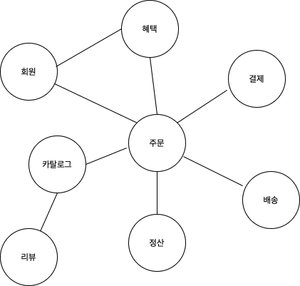

# 5주차 키워드 정리🎯

## Domain
### 도메인(Domain)?
- 도메인은 일반적인 요구사항, 전문 용어, 그리고 컴퓨터 프로그래밍 분야에서 문제를 풀기 위해 설계된 어떤 소프트웨어 프로그램에 대한 기능성을 정의하는 연구의 한 영역이다.
  즉, 도메인은 기획의 요구사항을 구현하고, 문제를 풀기 위해 설계된 소프트웨어 프로그램의 기능성을 정의하는 영역이라고 정의한다.
- ***`Domain`이란 사용자가 이용하는 앱 기능, 회사의 비즈니스 로직을 정의하는 영역이라고 이해해 볼 수 있다.***

### 그럼 도메인(Domain)과 엔티티(Entity)는 같은 말이 아닌가요?😯
- `Entity`?: 일반적으로 실체를 의미한다. 다양한 맥락에서 `Entity`의 의미는 다양하게 구체화 되어 사용된다.
- `Domain`은 비지니스 영역을 추상적으로 나타내는 개념, `Entity`는 `Domain`내에서 실제 개별 객체나 개념을 나타낸다.

### 도메인의 예시
> 온라인 서점 도메인


- 카탈로그 하위 도메인은 고객에게 구매할 수 있는 상품 목록을 제공하고, 주문 하위 도메인은 고객의 주문을 처리한다.
- 혜택 하위 도메인은 쿠폰이나 특별 할인 기회와 같은 서비스를 제공한다.
- ***하나의 하위 도메인은 다른 하위 도메인과 연동하여 완전한 기능을 제공***한다.
- 물론 소프트웨어에 필요한 모든 도메인을 구현하는 것이 아니다. -> 외부시스템 사용을 함으로서 정보 제공 기능만 이용가능하다.
- 또한 ***메인마다 고정된 하위 도메인이 항상 존재하는 것은 아니다.***
  

> 유저 도메인을 구현한 실제 엔티티
```java
//import, package 부분 생략
@Entity
@Getter
@Builder
@NoArgsConstructor(access = AccessLevel.PROTECTED)
@AllArgsConstructor
public class Member extends BaseEntity {

    @Id
    @GeneratedValue(strategy = GenerationType.IDENTITY)
    private Long id;

    @Column(nullable = false, length = 20)
    private String name;

    @Column(nullable = false, length = 20)
    private String nickname;

    @Column(nullable = false, length = 20)
    private String phoneNumber;

    @Enumerated(EnumType.STRING)
    @Column(columnDefinition = "VARCHAR(10)")
    private Gender gender;

    @Enumerated(EnumType.STRING)
    @Column(columnDefinition = "VARCHAR(15) DEFAULT 'ACTIVE'")
    private MemberStatus status;

    private LocalDate inactiveDate;

    @Column(nullable = false, unique = true, length = 50)
    private String email;

    @Column(nullable = false)
    private Integer point = 0;

    @OneToMany(mappedBy = "member", cascade = CascadeType.ALL, fetch = FetchType.LAZY)
    private List<MemberAddress> addressList = new ArrayList<>();

    @OneToMany(mappedBy = "member", cascade = CascadeType.ALL, fetch = FetchType.LAZY)
    private List<MemberAgree> memberAgreeList = new ArrayList<>();

    @OneToMany(mappedBy = "member", cascade = CascadeType.ALL, fetch = FetchType.LAZY)
    private List<MemberPrefer> memberPreferList = new ArrayList<>();

    @OneToMany(mappedBy = "member", cascade = CascadeType.ALL, fetch = FetchType.LAZY)
    private List<Review> reviewList = new ArrayList<>();

    @OneToMany(mappedBy = "member", cascade = CascadeType.ALL, fetch = FetchType.LAZY)
    private List<MemberMission> memberMissionList = new ArrayList<>();
}
```

---

## 양방향 맵핑
### 양방향 맵핑?
- JPA와 같은 ORM(Object-Relational Mapping) 프레임워크에서 엔티티 간의 관계를 설정할 때, ***양쪽 엔티티가 서로를 참조하도록 설정하는 것***이다.
- 이를 통해 두 엔티티 간의 참조가 양방향에서 접근 가능하도록 한다.

### 양방향 맵핑의 특징
- 양방향 매핑을 설정하면 두 엔티티 사이에서 서로 참조가 가능해진다.
- 따라서, 객체 입장에선 좀 더 자연스러운 데이터 조회가 가능하다.
- 하나의 엔티티가 해당 관계의 `Owner`가 되고, 다른 엔티티는 `Non-Owner`가 된다.
- 관계의 `Owner`는 외래키를 관리하는 엔티티라 보면 된다.
- `Owner`가 아닌 엔티티는 ***읽기 전용***으로 설정되어, 관계에 대해 수정할 수 없고 단순 참조만 가능하다.

### 양방향 맵핑의 예시
> - 이번 과제의 도메인중 Region과 MemberAddress의 관계를 가져왔습니다.
```java
@Entity
public class Region extends BaseEntity {

    @Id
    @GeneratedValue(strategy = GenerationType.IDENTITY)
    private Long id;

    //mappedBy로 지정되었다. 즉 이 관계의 Owner가 아니다.
    @OneToMany(mappedBy = "region", cascade = CascadeType.ALL, fetch = FetchType.LAZY)
    private List<MemberAddress> memberAddressList = new ArrayList<>();
    
    //생략
}
```
```java
@Entity
public class MemberAddress extends BaseEntity {

    @Id
    @GeneratedValue(strategy = GenerationType.IDENTITY)
    private Long id;

    //외래키를 가지며, 관계의 Owner라 할 수 있다.
    @ManyToOne(fetch = FetchType.LAZY)
    @JoinColumn(name = "region_id", referencedColumnName = "id")
    private Region region;

    // 생략
}
```

### 양방향 맵핑의 장단점
#### 장점
1. 편리한 참조 방식: 엔티티 간의 참조가 양쪽에서 가능하므로, 코드가 직관적이고 유연해진다.
2. 비지니스 로직 작성 용이함: 양방향으로 참조가 가능하기 때문에, 비지니스 로직 작성 시 양쪽 엔티티 모두 접근할 수 있어 유연한 로직을 작성하는데 도움을 준다.

#### 단점
1. 무한 루프의 문제: 양방향 메핑에서 메서드를 잘못 구현시 순환 참조로 인한 `무한 루프`가 발생할 수 있다.
2. 복잡성의 증가: 양방향 매핑 설정시 객체 간의 의존성이 커져 코드가 복잡해질 수 있다. 
   - 양쪽의 연관관계를 ***항상 유지해야한다.*** 즉 실수로 관계를 다른 한쪽에만 설정하거나 변경시 오류가 발생할 수 있다.


---

## N + 1 문제
> 1번의 조회 쿼리 실행 후 N번의 추가 쿼리가 발생해버렸다...

### N + 1문제?
- 한번의 데이터 조회로 예상했던 것 보다 더 많은 쿼리가 발생하는 문제이다.
- 주로 ORM 프레임워크에서 `다대일` 혹은 `일대다` 관계를 조회시 자주 발생하는 문제이다.

### N + 1문제 예시
> 다시 한번, `Region`과 `MemberAddress`의 관계같은 `일대다` 관계로 예시를 가지겠습니다.
```java
@Entity
public class Region extends BaseEntity {

    @Id
    @GeneratedValue(strategy = GenerationType.IDENTITY)
    private Long id;
    
    @OneToMany(mappedBy = "region", cascade = CascadeType.ALL, fetch = FetchType.LAZY)
    private List<MemberAddress> memberAddressList = new ArrayList<>();
    
    //생략
}

@Entity
public class MemberAddress extends BaseEntity {

    @Id
    @GeneratedValue(strategy = GenerationType.IDENTITY)
    private Long id;
    
    @ManyToOne(fetch = FetchType.LAZY)
    @JoinColumn(name = "region_id", referencedColumnName = "id")
    private Region region;

    // 생략
}
```

- 이때 `QueryDSL`을 사용하여 단순히 `Region`목록을 볼려고 한다.
- 해당 예시는 엔티티의 memberAddress가 ***지연 로딩(Lazy Loading)*** 으로 설정되어 있어, 각 `Region`에 대해 `MemberAddress`를 가져올 때 추가쿼리가 발생한다.

```java
QRegion region = QRegion.region;
QMemberAddress memberAddress = QMemberAddress.memberAddress;

// Region만 조회하는 쿼리 (N+1 문제 발생이 가능하다)
List<Region> regions = queryFactory
        .selectFrom(region)
        .fetch();

// 각 Region에 대해 memberAddresses 접근 시 추가 쿼리 발생
for (Region region : regions) {
        System.out.println(region.getName() + " has " + region.getMemberAddresses().size() + " members.");
}
// 만약 지역이 10개라면 총 11개의 쿼리가 실행된다.
```

### N + 1문제의 해결 방법?
- 이후 6주차 Keyword.md에 추가 예정입니다.

