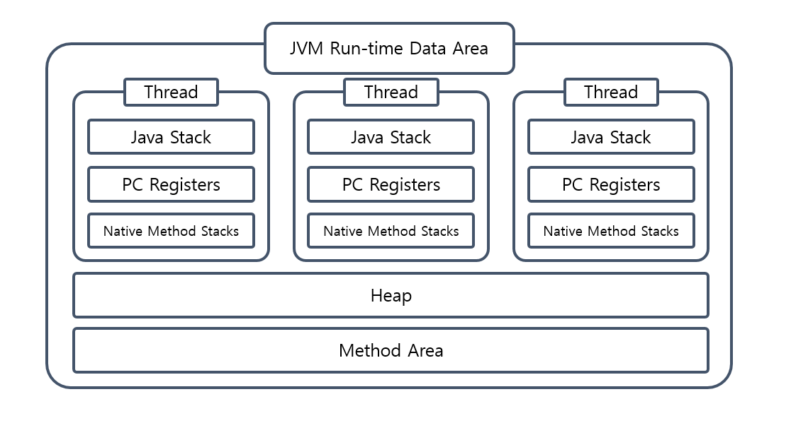
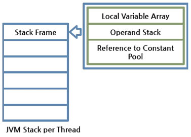
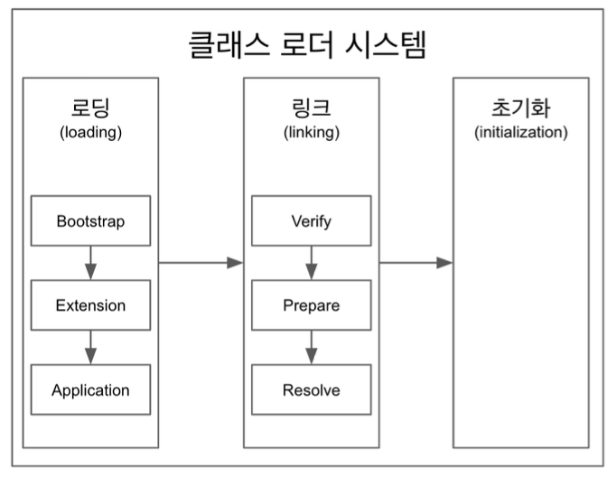
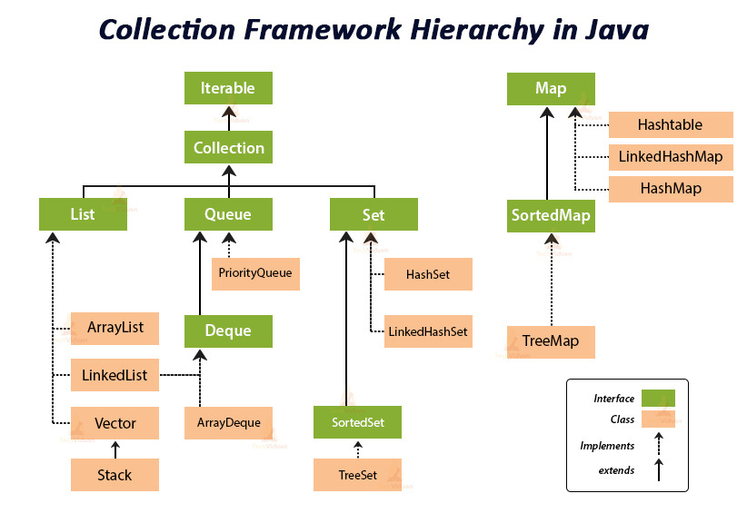

# Chapter 2. JAVA 추가 미션
### ‼️ 추가과제) 해당 키워드에 대해서 공부한 후 간단정리후 제출 & 면접질문 최소 한개 만들어서 제출 후 스터디 시간에 스터디원들과 질문하기!

## 1. static 키워드
### 1) 스태틱(static) 이란?
- 자바에서 스태틱(static) 키워드는 클래스 레벨의 변수나 메소드에 사용되며, 이를 통해 객체 생성 없이 해당 변수나 메소드에 접근할 수 있다. 
- 스태틱 멤버는 클래스가 메모리에 로드될 때 단 한 번만 생성되며, 모든 인스턴스가 공유하는 공통의 자원이 된다.
- 스태틱 키워드의 주요 사용 사례로는 상수 선언, 유틸리티 함수 구현, 싱글턴 패턴 구현 등이 있다. 이러한 특성은 메모리 관리와 성능 최적화에 기여한다.
- 왜냐하면 스태틱 멤버는 클래스 단위로 관리되어 메모리 사용량을 줄이고, 객체 생성 오버헤드 없이 접근할 수 있기 때문이다다.

### 2) 스태틱 변수 (static variables)
- 스태틱 변수는 클래스의 모든 인스턴스가 공유하는 변수다.
- 예를 들어, 특정 클래스의 인스턴스 개수를 추적하거나, 클래스가 공통으로 사용하는 설정 정보를 저장하는 데 사용된다.
- 스태틱 변수는 클래스가 로드될 때 생성되며 프로그램 종료 시까지 유지된다. 이는 전역 변수와 ***유사한 역할***을 하지만, ***클래스 내부에서만 접근 가능한 범위***를 가진다.
- 왜냐하면 스태틱 변수는 클래스 레벨에서 관리되어 클래스의 모든 인스턴스 간에 데이터를 공유하고, 일관된 상태를 유지하기 위해 사용되기 때문이다.

### 3) 스태틱 메소드 (static method)
- 스태틱 메소드는 객체의 생성 없이 호출할 수 있는 메소드로, 유틸리티 함수나 헬퍼 함수를 구현하는 데 주로 사용된다.
- 예를 들어, Math 클래스의 sqrt나 random 같은 메소드는 스태틱 메소드의 예다.
- 스태틱 메소드는 인스턴스 변수나 메소드에 접근할 수 없으며, 오직 스태틱 변수나 다른 스태틱 메소드에만 접근할 수 있다. 이는 스태틱 메소드가 인스턴스에 속하지 않고 클래스에 속하기 때문이다.
- 왜냐하면 스태틱 메소드는 인스턴스의 상태에 의존하지 않고, 클래스 레벨에서 공통적으로 사용되는 기능을 제공하기 위해 사용되기 때문이다.

---

## 2. JVM Memory

### 0) JVM 이란?
- JVM 이란 Java Virtual Machine의 약자이며, 자바 가상 머신이라고 불린다.
- Java의 바이트 코드를 해석하고 실행하는 역할을 한다.
- OS에 상관없이 실행할 수 있는것이 장점이다. (JVM 설치만 하면 어떤 운영체제에서든 java 파일을 실행할 수 있다.)
- JRE(JAVA Runtime Environment)안에 JVM과 개발 도구들이 포함되어 있다.

### 1) Runtime Data Area
- JVM이 OS에서 실행될 때 할당받는 메모리 영역이다.

#### [1] Method Area(=***Staic Area***, class Area)
- Method Area는 JVM이 시작될 때 생성되며, JVM 한 개에 하나의 Method Area만 생긴다.
- 모든 JVM thread들은 같은 Method Area를 공유한다. 
- Method Area는 논리적으로 Heap에 포함되며, Java 8 이후로는 Metaspace라는 OS가 관리하는 영역으로 옮겨졌다. 
- Method Area는 static 변수, 런타임 상수 풀, 필드 데이터, 메소드 데이터, 클래스로더 레퍼런스 등 클래스 레벨의 데이터를 저장한다.

#### [2] Heap
- Heap 또한 JVM 당 하나의 Heap Area가 생기며, 모든 JVM thread들은 같은 Heap을 공유한다.
- new 연산자로 생성된 모든 객체와 관련된 인스턴스 변수와 배열, 문자열에 대한 정보를 가진 String Pool 등이 Heap 영역에 저장되며, Garbage Collection의 대상이 된다.
  - Garbage Collection?: 프로그램을 개발 하다 보면 유효하지 않은 메모리인 가바지(Garbage)가 발생하게 된다. 예시로 C언어를 이용하면 free()라는 함수를 통해 직접 메모리를 해제해주어야 한다. 하지만 Java나 Kotlin을 이용해 개발을 하다 보면 개발자가 메모리를 직접 해제해주는 일이 없다. 
  > 그 이유는 JVM의 가비지 컬렉터가 불필요한 메모리를 알아서 정리해주기 때문이다.
- Method Area와 Heap은 멀티 스레드에서 공유되는 메모리로, Method Area와 Heap Area에 저장되는 데이터들은 thread-safe 하지 않다.
  - thread-safe?: 다수의 스레드가 공유 자원에 접근해도 프로그램이 문제 없이 동작하는 것을 의미한다.
  > "Thread Safety는 단순히 한 번에 하나의 스레드가 공유 자원에 접근하도록 보장하는 것만을 의미하지 않는다. race condition, deadlock, livelock, starvation이 발생하지 않는 동시에 공유 자원에 대한 순차적인 접근이 이루어지도록 보장해야 한다."

#### [3] Stack
- Stack은 공유 자원이 아니므로 thread-safe하고 각 thread가 시작되면, 메서드 호출을 저장하기 위한 별도의 런타임 스택이 각각 생성된다.
- 모든 메소드를 호출할 때마다 하나의 ***Frame***이 생성되어 런타임 스택의 맨 위에 추가되며 이러한 항목을 ***Stack Frame***이라고 한다.
  

#### [4] PC Register
- 쓰레드 마다 쓰레드 내 현재 실행할 스택 프레임을 가르키는 포인터가 생성된다.

#### [5] Native Method Stack
- 네이비티브 메소드 스택이란 자바 외의 언어로 작성된 네이티브 코드를 위한 스택이다.

- 각 stack frame은 실행 중인 메서드가 속한 클래스의 로컬 변수 배열, 피연산자 스택(메소드 내 연산을 위해 바이트 코드 명령문들이 있는 공간), 런타임 상수 풀에 대한 참조가 있다.
- 로컬 변수 배열과 피연산자 스택의 크기는 컴파일하는 동안 결정된다. 따라서 스택 프레임의 사이즈는 메소드에 의해 크기가 고정된다.

---

## 3. Class Loader System Area
자바 바이트 코드를 읽고 메모리에 적재하는 역할을 수행하는데 메모리를 적재하는 과정은 크게 3개로 나뉜다.
- 로딩(loading) : 클래스를 파일에서 가져와서 JVM의 메모리에 로드한다.
- 링크(linking) : 레퍼런스를 연결하는 과정 
- 초기화(initialization) : static 한 값들을 초기화 한다.

  - 백기선, 더 자바, 코드를 조작하는 다양한 방법, 2019

### 1) static과 Class Loader그리고 Memory

- 클래스 로더가 .class 파일을 탐색 중 static 키워드를 보는 순간 객체가 생성되지 않아도 항상 메모리를 할당해야 하는 멤버로 보고
  Method Area에 메모리를 할당한다. 
- 그래서 static 키워드가 붙은 멤버들은 객체(인스턴스)에 소속된 변수가 아니라 클래스에 소속된 변수이기 때문에 클래스 메서드라고 부른다.
- 즉, ***모든 객체가 메모리 영역을 공유***한다.

---

## 4. ***JAVA Collection Framwork***

### 1) 컬렉션 프레임워크란?
- 컬렉션은 다수의 요소를 하나의 그룹으로 묶어 효율적으로 저장하고, 관리할 수 있는 기능을 제공하는 일종의 컨테이너이다. 
- 배열은 크기가 고정되어 있는데에 반해, 컬렉션 프레임워크는 가변적인 크기를 갖는 (Resizable) 등의 특징을 갖는다. 
- 또한 데이터 삽입, 탐색, 정렬 등 편리한 API 를 다수 제공한다.

### 2) 컬렉션 프레임워크의 이점?
***유지 보수적 측면에서 아주 효율적이다!***
- List, Queue, Set, Map 등의 인터페이스를 제공하고, 이를 구현하는 클래스를 제공하여 일관된 API 를 사용할 수 있다.
- 가변적인 저장 공간을 제공한다. 고정적인 저장 공간을 제공하는 배열에 대비되는 특징이다.
- 자료구조, 알고리즘을 구현하기 위한 코드를 직접 작성할 필요 없이, 이미 구현된 컬렉션 클래스를 목적에 맞게 선택하여 사용하면 된다.
- 제공되는 API 의 코드는 검증되었으며, 고도로 최적화 되어있다.

### 3) 컬렉션 프레임워크의 구성요소
> 인터페이스, 클래스 그리고 알고리즘으로 구성되어있다. 이번주차에는 그중 컬렉션 인터페이스에 대해서만 설명한다!

### 4) 컬렉션 인터페이스의 구성요소

#### [1] List 인터페이스
- 저장 순서가 유지되는 컬렉션을 구현시 사용한다.
- 같은 요소의 중복 저장을 허용한다.
- 배열처럼 index를 통해서 요소에 접근한다.
- 배열과의 차이는 리스트는 자료형의 크기가 가변적이다.
- 요소 사이에 빈공간 허용 x -> 삽입/삭제시 배열 이동이 계속 발생한다.
- 해당 인터페이스 상속을 하는 클래스는 ***ArrayList, LinkedList, Vector, Stack***이 있다.

#### [2] Queue 인터페이스
- FIFO구조이다.
- 처음 들어온 원소가 가장 먼저 나간다.
- 해당 인터페이스 상속을 하는 클래스는 ***PriorityQueue, ArrayDeque***가 있다. + LinkedList 또한 Queue 인터페이스를 동시상속하고 있다.

#### [3] Set 인터페이스
- 데이터의 ***중복***을 허용치 않고 순서를 유지하는 데이터의 집합이다.
- 순서자체가 없으므로, get(index)가 작동하지 않는다.
- 중복저장이 불가하므로, NULL값 또한 하나만 저장가능한다.
- 해당 인터페이스 상속을 하는 클래스는 ***HashSet, LinkedHashSet, TreeSet***이 있다.

---

### 5) 예상 면접 질문
> static 변수는 Data Area 중 어디에 저장되고 그로인한 단점이 있을까?
>> A. Method Area에 저장된다. 단점으로는 변수의 생명주기가 애매하기 때문에 (JVM종료시 까지 메소드영역에 살아있음) 메모리 낭비가 있을 수 있다.
> 또한 모든 쓰레드가 해당 영역을 접근할 수 있기 때문에, 각 thread에서 동시에 해당 변수를 조작할 수 있기 때문에 sync처리가 필요하고, 부가적인 오버헤드를 유발할 수 있다.

