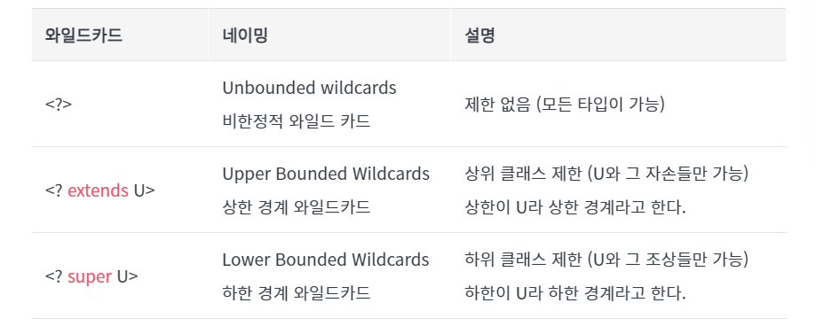

# Chapter 2. JAVA 추가 미션
### ‼️ 추가과제) 해당 키워드에 대해서 공부한 후 간단정리후 제출 & 면접질문 최소 한개 만들어서 제출 후 스터디 시간에 스터디원들과 질문하기!

## 1. 제네릭
### 1) 제네릭 (Generics) 이란?
- 클래스 내부에서 사용할 데이터 타입을 외부에서 저장하는 기법이다.
    - 객체별로 다른타입의 자료가 저장될 수 있도록 해준다.

```java
import java.util.ArrayList;

ArrayList<Integer> list = new ArrayList<>();
```
- 이때의 `<>`가 제네릭이다. 이처럼 제네릭은 컬렉션 클래스나 메소드에서 사용할 내부 데이터 타입을 ***외부***에서 지정하는 이른바 ***타입을 변수화 한 기능***이다.

### 2) 제네릭 타입 매개변수
- 제네릭은 `<>` 키워드를 사용하는데 이를 **다이아몬드**연산자라고 한다.
- 꺽쇠 괄호 안에 식별자 기호를 통해 파라미터화가 가능하다. 그리고 이를 `타입 매개변수(parmeter)`라고 부른다.

```java
import java.util.ArrayList;

class Zoo<T> {
    List<T> animals = new ArrayList<>();
    
    public void add(T animal) {
        animals.add(animal);
    }
}

Zoo<Penguin> penguinZoo = new Zoo<>();

Zoo<Horse> horseZoo = new Zoo<>();
```
- 제네릭 클래스를 만들고 인스터스화를 하였다.
- 원하는 타입 명을 입력하면 해당 타입 명이 타입 파리미터 `T`가 지정된 타입으로 모두 변환되어 클래스 타입이 지정된다.
- 내부의 `T`타입이 외부에 타입을 받아와 변환되어 설정하는 것을 `구체화`라고 한다.
- *jdk 1.7 버전* 이후, new 생성자 부분의 제네릭 타입을 생략할 수 있다. java에서 알아서 추론하여 생략된 곳에 타입을 넣어준다.

### 3) 타입 파라미터의 할당 가능 타입
- 제네릭에서 할당 받을 수 있는 타입은 오직 ***Reference*** 타입이다.
- int, double 같은 원시 타입(Primitive Type)을 제네릭 타입 파라미터로 불가하다.

```java
import java.util.List;

List<int> intList = new List<>();
//오류 발생! 원시 타입 사용

List<Integer> integerList = new List<>();
//Wrapper 클래스로 넘겨주자. (Wrapper 클래스는 이후 설명)
```
- 해당 예시의 코드처럼, Integer 클래스가 타입으로 온다.
  - 이 말은, 객체지향의 특성인 다형성의 원리가 그대로 적용 가능하다는 소리다.

```java
class Animal {}
class Penguin extends Animal {}
class Horse extends Animal {}

class Zoo<T> {
    List<T> animals = new ArrayList<>();
    
    public void add (T animal) {
        animals.add(animal);
    }
}

public class Main {
    public static void main(String[] args) {
        Zoo<Animal> seoulZoo = new Zoo<>();
        
        //다형성의 원리 적용가능 파트
        seoulZoo.add(new Animal());
        seoulZoo.add(new Penguin());
        seoulZoo.add(new Horse());
    }
}
```

### 4) 복수 타입 파라미터
- 파라미터 변수를 하나만 지정하는 것이 아닌 여러 개를 지정 가능하다.
- `<T, E, K>` 와 같은 형식을 통해 복수의 타입 파라미터를 지정가능하다.
- 물론, 클래스 초기화시 해당 제네릭 타입의 개수만큼 타입을 넘겨주어야한다.

### 5) 제네릭의 이점
- 컴파일 타임에 타입 검사를 통해 예외를 방지한다.
  - 제네릭은 클래스나 메서드를 정의할 때 타입 파라미터로 객체의 서브 타입을 지정해줌으로 써,
  혹여 `잘못된 타입`이 사용될 수 있는 문제를 컴파일 과정에서 미리 제거하여 개발을 원활하게 해준다.
- 불필요한 Casting을 없애므로 성능 향상에 도움을 준다.
  - 다운캐스팅, 업캐스팅은 추가적인 오버헤드의 원인이 된다. 이를 미리 타입을 지정 및 제한을 하여 형변환의 번거러움을 줄일 수 있고 성능을 올릴 수 있다.

### 6) 제네릭 사용 시, 주의 사항
- 제네릭 타입의 객체는 생성이 불가하다.
```java
class animal<T> {
    public void method() {
        //직접적인 제네릭 사용은 불가하다.
        T t = new T();
    }
}
```

- Static 멤버에 제네릭 타입이 올 수 없다.
  - 저번 주차에 static의 의미와 생성되는 과정을 기술하였다. 💡[Static?](../chapter02/java_mission.md)
  - static 멤버는 클래스와 동일하게 공유하는 변수로, ***제네릭 객체 생성 이전에***, 이미 자료 타입이 지정되어야하기 떄문이다.

---

## 2. 래퍼 클래스
### 1) 래퍼 클래스 (Wrapper class)란?
- 기본 자료타입을 객체로 다루기 위해서 객체로 포장하여 사용하는 클래스를 지칭한다.
- 모든 래퍼 클래스는 `java.lang` 패키지에 포함하여 제공된다.


### 2) 박싱과 언박싱 (Boxing and unBoxing)
- 래퍼 클래스는 산술 연산이 불가 하므로 인스턴스에서 저장된 값을 연산을 통해 변경할 수 없다.
- 그저, 값을 참조하기 위해 새로운 인스턴스를 생성하고 생성된 인스턴스의 값만 참조 가능하다.
- `박싱`은 `기본 타입의 데이터 -> 래퍼 클래스의 인스턴스`
- `언박싱`은 `래퍼 클래스의 인스턴스에 저장된 값 -> 기본 타입의 데이터`

### 3) 오토 박싱과 오토 언박싱
- *JDK 1.5 버전*이상 부터는 박싱과 언박싱이 필요한 상황에서 자바 컴파일러가 이를 자동으로 판단하고 처리해준다.
```java
Integer num = new Integer(25); //boxing
int n = num.intValue(); //unboxing
System.out.println(n);

Character ch = 'K'; //Character ch = new Character('K');: 오토 박싱
char c = ch;    //char c = ch.charValue();: 오토 언박싱
System.out.println(c);
```

---

## 3. 옵셔널
### 1) 옵셔널 (Optional)이란?
- 옵셔널은 **값이 있을 수도 있고 없을 수도 있는 객체**를 감싸는 래퍼 클래스다.
- 이를 통해 깔끔하게 널(`null`) 체크를 할 수 있으며, `NullPointerException`이 발생하는 것을 방지할 수 있다.
- 옵셔널을 사용함으로써 명시적으로 해당 값이 존재할 수도, 존재하지 않을 수도 있음을 표현할 수 있기 때문이다.
  - 이는 코드의 가독성을 향상시키고, 오류를 예방하는데 크게 기여한다.

### 2) 옵셔널의 사용 방법 및 대표적인 Method
- Optional 클래스를 사용하여 값을 감싸면 되는데, 이때 감싸는 대상은 객체만 가능하다. 
- 기본형 데이터에는 OptionalInt, OptionalLong 등의 별도 클래스를 사용해야 한다.
- Optional 객체를 생성하려면 `of()` 메서드 또는 `ofNullable()` 메서드를 사용한다. 참조 변수의 값이 `null`일 가능성이 있다면, `ofNullable()` 메서드를 사용한다.

#### 1] isPresent()
- `isPresent()` 메서드는 Optional 객체의 참조 변수의 값이 `null`이면 `false`를, `null`이 아니면 `true`를 반환한다.
```java
Optional<String> opt1 = Optional.ofNullable(null);
Optional<String> opt2 = Optional.ofNullable("123");

System.out.println(opt1.isPresent()); // false
System.out.println(opt2.isPresent()); // true
```

#### 2] empty()
- `Optional` 타입의 참조 변수를 기본값으로 초기화하려면 `empty()` 메서드를 사용한다.

#### 3] get()
- Optional 객체에 저장된 값을 가져오고 싶을 때, `get()` 메서드를 이용한다.
  - 만약 `null`일 가능성이 있다면, `orElse()` 메서드를 통해 디폴트 값을 지정할 수 있다.

### 💡 [추가적인 Optional 정보를 얻고 싶다면?](https://docs.oracle.com/javase/8/docs/api/java/util/Optional.html)

---
## 4. 와일드카드
> ***제네릭의 타입 파라미터는 공변성이 없다.*** 그 떄문에, 캐스팅 시 애로사항이 발생한다.
> 그리고 이를 `와일드카드`를 이용하여 문제를 해결한다.

### 1) 공변성?_?
- 일반 클래스는 다형성의 성질을 가지고 있다. Object 타입으로 선언한 parent 변수와 Integer 타입으로 선언한 child 변수가 있는데 객체 지향 프로그래밍에선 이들 끼리 서로 간에 캐스팅이 가능하다.
- 제네릭 클래스 역시 다형성의 성질을 가지고 있다. ex) Collection - ArrayList (parent - chile 관계) 관계는 캐스팅이 가능하다.
- 제네릭의 `타입 파라미터<>` 끼리는 타입이 상속 관계여도 캐스팅이 불가능하다.
- 제네릭은 ***오직 전달받은 그 타입으로만*** 캐스팅이 가능하다.

```java
import java.util.*;

Object parent = new Object();
Integer child = new Integer(10);
parent = child; //Upcasting, 물론 Downcasting도 가능하다.

Collection<Integer> parent = new ArrayList<>();
ArrayList<Integer> child = new ArrayList<>();
parent = child; //Upcasting

ArrayList<Object> parent = new ArrayList<>();
ArrayList<Integer> child = new ArrayList<>();
parent = child; // !문제 발생! 업캐스팅 불가
child = parent; // !역시 문제 발생! 다운캐스팅 불가
```

- 이런 성질로 만약 인자로 해당 제네릭 타입을 받고 싶다?
  - *오버로딩*으로 인한 코드량 폭발... :(

### 2) 불공변성으로 인한 코드량을 줄여줄 ***와일드카드***

- 상한 경계 와일드카드 `<? extends T>` : ***공변성***을 적용
- 하한 경계 와일드카드 `<? super T>` : ***반공변성***을 적용

### 3) 그럼 그냥 `<?>` 말고 `<Object>`를 쓰면 되지 않을까?
- 결론부터 말하자면 ***다르다.***
- 예시로 `List<?>`, `List<Object>`를 비교한다. 
  - `List<Object>`에는 Object의 하위타입을 모두 넣을 수 있다.
  - `List<?>`에는 오직 `null`만 넣을 수 있다.(extends 의 특징)  
- 비슷한 예시로 `<T extends 타입>`은 존재하나, `<T super 타입>` 역시 없다.
  - `<T super 타입>`이 만약에 된다면, 수많은 자바 클래스 및 인터페이스 올 수 있기에 이는 Object랑 다름없는 쓸데없는 코드이다.

---

## 면접질문
- 래퍼 클래스를 사용하는 이유?
> wrapper 클래스를 사용하는 이유는 참조형 자료형을 사용하는 이유와 같다.
기본 자료형의 값을 단순히 값으로만 사용하지 않고 그 값에 대한 메서드를 사용 혹은 null값을 이용하기 위해 사용된다.
> > 주되게, 제네릭 그리고 기본 자료형의 값을 문자열로 변환 혹은 반대 경우 사용한다.