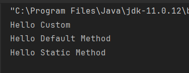
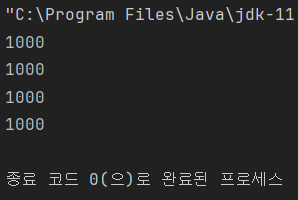
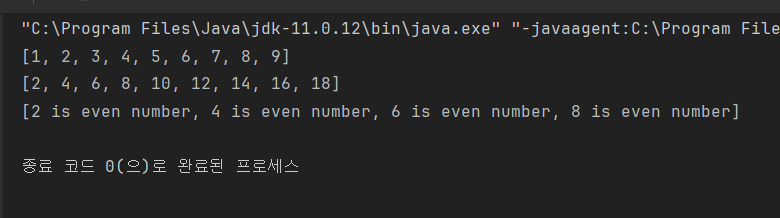

# Chapter 4. JAVA 추가 미션🎯
## 함수형 인터페이스

### 1) 함수형 인터페이스(Functional Interface)?
- 1개의 `추상 메소드`를 갖는 인터페이스를 말한다.
- `Java8`부터 인터페이스는 기본 구현체를 포함한 `디폴트 메서드 (default method)`를 포함 할 수 있다.
- `default method`뿐만 아니라 `static method`가 여러개 존재해도 추상 메서드가 한개라면 함수형 인터페이스이다.
- 자바의 람다 표현식은 함수형 인터페이스로만 사용 가능하다.

### 2) 함수형 인터페이스의 예시
- 함수형 인터페이스를 만들 때, `@FuctionalInterface` 어노테이션을 사용하여, 해당 인터페이스가 함수형 인터페이의 조건에 맞는지 검사해준다.
```java
@FunctionalInterface
interface CustomInterface<T> {
    T myCall();

    //default method는 조건에 관계 없다.
    default void printDefault() {
        System.out.println("Hello Default Method");
    }

    // static method는 조건에 관계 없다.
    static void printStatic() {
        System.out.println("Hello Static Method");
    }
}

public class Main {
    public static void main(String[] args) {
        CustomInterface<String> customInterface = () -> "Hello Custom";

        String s = customInterface.myCall();
        System.out.println(s);

        customInterface.printDefault();

        CustomInterface.printStatic();
    }
}
```
- 실제 결과


- 혹여 함수형 인터페이스 형식에 맞지 않는다면?: `@FunctionalInterface`가 에러를 띄워준다.
> Multiple non-overriding abstract methods found in interface
> com.practice.notepad.CustomFunctionalInterface

### 3) JAVA에서 기본적으로 제공하는 Functional Interfaces
- 함수형 인터페이스를 일일히 만들고 사용하기엔 불편함이 존재한다.
- JAVA는 그런 불편함을 해소하기 위해 기본적으로 사용되는 인터페이스를 제공한다.

|   함수형 인터페이스    |  Descriptor   |          Method           |
|:--------------:|:-------------:|:-------------------------:|
|   Predicate    | `T->boolean`  |    `boolean test(T t)`    |
|    Consumer    |   `T->void`   |    `void accept(T t)`     |
|    Supplier    |    `()->T`    |         `T get()`         |
| Function<T, R> |    `T->R`     |      `R apply(T t)`       |
|   Comparator   | `(T, T)->int` | `int compare(T o1, T o2)` |
|    Runnable    |  `()->void`   |       `void run()`        |
|    Callable    |    `()->T`    |        `T call()`         |

#### 4) 두 개의 인자를 받는  Bi 인터페이스
- 특정 인자를 받는 `Predicate`,`Consumer`,`Function`등은 두 개 이상의 타입을 받을 수 있는 인터페이스가 존재한다.

|  함수형 인터페이스  |    Descriptor     |          Method          |
|:-----------:|:-----------------:|:------------------------:|
| BiPredicate | `(T, U)->boolean` | `boolean test(T t, U u)` |
| BiConsumer  |  `(T, U)->void`   | `void accept(T t, U u)`  |
| BiFunction  |    `(T, U)->R`    |   `R apply(T t, U u)`    |


#### 5) Keyword Problem!
> java.util.function 패키지의 Function<T,R>을 사용해서 Integer을 인자로 받아 String으로 변환하는 함수를 만들어주세요!  
> Function클래스의 apply를 네가지 방법으로 구현해 주세요

> 1.익명클래스 정의  
> 2.클래스 파일을 만들어 상속받아서 정의  
> 3.람다식으로 정의  
> 4.메서드 참조로 정의

```java
import java.util.function.Function;

class MyFunction implements Function<Integer, String> {
    MyFunction() {}

    @Override
    public String apply(Integer i) {
        return Integer.toString(i);
    }
}


public class Main {
    public static void main(String[] args) {
        //1. 익명클래스 정의
        Function<Integer, String> function = new Function<Integer, String>() {
            @Override
            public String apply(Integer t) {
                return Integer.toString(t);
            }
        };
        System.out.println(function.apply(1000));

        //2. 클래스 파일을 만들어 상속받앗 정의
        MyFunction myFunction = new MyFunction();
        System.out.println(myFunction.apply(1000));

        //3. 람다식으로 정의
        Function<Integer, String> lamdaFunction = a -> Integer.toString(a);
        System.out.println(lamdaFunction.apply(1000));

        //4. 매서드 참조로 정의
        System.out.println(String.valueOf(1000));
    }
}

```
- 실행 결과
- 

---

## Stream API
### 1) Stream API?
- JAVA8부터 `Stream API`와 `람다식`, `함수형 인터페이스`를 지원하면서 함수형으로 프로그래밍이 가능하게 되었다.
- Stream API는 ***데이터를 추상화하고, 처리하는데 자주 사용되는 함수들을 정의***한 `API`라고 볼 수 있다.

### 2) Stream API의 특징
#### 1. 원본의 데이터를 변경하지 않는다.
- Stream API는 원본의 데이터를 조회하여 원본의 데이터가 아닌 별도의 요소들로 Stream을 생성한다.
- 원본의 데이터는 단지 읽기용이며, 정렬, 필터링 같은 작업은 별도의 Stream의 요소들에서 처리된다.

```java

import java.util.Arrays;
import java.util.Collections;

String[] nameArr = {"Winter", "Karina", "Giselle", "Ningning"};
List<String> nameList = Arrays.asList(nameArr);

Stream<String> nameStream = nameList.stream();
List<String> sortedList = nameStream.sorted()
        .collect(Collections.toList());
```

#### 2. Stream은 ***무조건 일회용***이다.
- Stream API는 일회용이기 때문에 한번 사용시 재사용이 불가능 하다.
- Stream이 필요한 경우는 재생성후, 사용해야 한다.

#### 3. 내부 반복으로 작업을 처리한다.
- Stream을 이용하면 코드가 간결한 이유? >> `내부 반복`
- 기존 코드는 for이나 while과 같은 문법을 사용해야 했으나, stream은 그런 반복문을 메소드 내부에 숨겨놓았다. (API의 성질)

### 3) Stream 생성하기
- `Collection`의 `stream`생성: `Collection`의 인터페이스에는 `stream()`이 정의되어 있다.
- 따라서 해당 인터페이스를 구현한 객체 (`List`, `Set`등)은 모두 이 메소드를 이용해 stream을 생성할 수 있다.

```java
//List로부터 스트림을 생성
import java.util.*;
List<String> list = Arrays.asList("a1", "b2", "c3");
Stream<String> listStream = list.stream();
```

- `배열`의 원소들을 소스로 하는 `stream`생성: `Stream`의 `of`메소드 또는 `Arrays`의 `stream` 메소드를 사용한다.

```java
//배열 -> 스트림
import java.util.*;
Stream<String> stream = Stream.of("a", "b", "c");
Stream<String> stream = Stream.of(new String[] {"a", "b", "c"});
Stream<String> stream = Arrays.stream(new String[] {"a", "b", "c"});
Stream<String> stream = Arrays.stream(new String[] {"a", "b", "c"}, 0, 3); //END 범위는 포함하지 않는다.
```
- 위의 객체를 위한 Stream 외에도 `int`, `long`과 같은 원시 자료형들도 사용하기 위한 특수 종류의 Stream(`IntStream`, `LongStream`, `DoubleStream`) 들도 사용가능하다.
- `IntStream`의 경우 `range()`함수를 사용하여 기존의 `for문` 대체 가능하다.
```java
//1부터 10까지의 숫자를 갖는 IntStream
IntStream stream = IntStream.range(1, 10);
```

### 4) Stream 가공(중간 연산)
#### [필터링] (Filter)
- Filter는 Stream에서 조건에 맞는 데이터만을 정제하여 더 작은 컬렉션을 만들어내는 연산이다.
```java
//String의 stream에서 "x"가 들어간 문자열만을 포함하도록 필터링 하는 예제
Stream<String> stream = 
    list.stream()
            .filter(name -> name.contains("x"));
```

#### [데이터 변환] (Map)
- Map은 기존의 Stream 요소들을 변환하여 새로운 Stream을 형성하는 연산이다.
- 지정된 값을 특정한 형태로 변환하는 데 주로 사용한다.
```java
//String 요소들로 갖는 Stream을 모두 대문자 String의 요소들로 변환하는 예제
Stream<String> stream = 
    names.stream()
            .map(s -> s.toUpperCase());
```

#### [정렬] (Sorted)
- Stream의 요소들을 정렬하기 위해 sorted를 사용해야 한다.
- 파라미터로 Comparator를 넘길 수도 있다. (기본 형태는 오름차순)

```java
public class example {
    List<String> list = Arrays.asList("Java", "GO", "C++", "JavaScript", "Swift", "Python");

    Stream<String> stream1 = list.stream()
            .sorted();
    //[C++, GO, Java, JavaScript, Python, Swift]
    List<String> sortedList1 = stream1.collect(Collectors.toList());
    
    Stream<String> stream2 = list.stream()
            .sorted(Comparator.reverseOrder());

    //[Swift, Python, JavaScript, Java, GO, C++]
    List<String> sortedList2 = stream2.collect(Collectors.toList());
}
```

#### [중복 제거] (Distinct)
- Stream의 요소가 중복된 데이터가 존재시, 중복을 제거하기 위해 distinct 사용 가능하다
- 이때 중복된 데이터를 검사하기 위해 Object의 `equals()` Method를 사용한다.
- 따로 만든 클래스를 Stream으로 사용시에 `equals()`, `hashcode()`를 `Override`했다면 해당 클래스도 사용 가능하다.

```java
List<String> list = Arrays.asList("Java", "Java", "C++", "JavaScript", "Java", "Python");

Stream<String> stream = list.stream()
        .distinct();
//[Java, C++, JavaScript, Python]
```

#### [특정 연산 수행] (Peek)
- Stream의 요소들으 대상으로 Stream에 영향을 주지않고 특정 연산을 수행하기 위한 peek 함수가 존재한다.
- peek 함수는 Stream의 각각의 요소들에 대해 ***특정 작업을 수행할 뿐 결과에 영향을 주지 않는다.***

```java
import java.util.stream.IntStream;
int sum = IntStream.range(1, 10)
        .peek(System.out::println)
        .sum();
```

### 5) Stream 최종 연산
#### [최댓값/최솟값/총합/평균/갯수]  (Max/Min/Sum/Average/Count)
- min, max, average는 Stream이 비어있는 경우에는 값을 특정할 수 없다.
- 그렇기 때문에, `Optional`로 값이 반환된다.

```java
import java.util.*;
OptionalInt min = IntStream.of(1, 3, 5, 7, 9).min();
int max = IntStream.of().max().orElse(0);
```

- 반면, 총합이나 갯수의 경우에는 값이 비어있는 경우 0으로 특정 가능하다
- 따라서, `Optional`로 반환되지 않고 원시값을 반환하도록 구현하였다.

```java
long count = IntStream.of(1,3,5,7,9).count();
long sum = LongStream.of(1,3,5,7,9).sum();
```

#### [데이터 수집] (collect)
- Stream의 요소들을 `List`, `Set`, `Map`등등의 다른 종류의 결과로 수집하고 싶은 경우에는 collect 함수를 이용할 수 있다.

```java
/*
 * collect() : 스트림의 최종연산, 매개변수로 Collector를 필요로 한다.
 * Collector : 인터페이스, collect의 파라미터는 이 인터페이스를 구현해야한다.
 * Collectors : 클래스, static 메소드로 미리 작성된 컬렉터를 제공한다.
 */

//collect의 파라미터로 Collector의 구현체가 와야한다.
Object collect(Collector collector);
```

#### [조건 검사] (Match)
- Stream의 요소들이 특정한 조건을 충족하는지 검사하고 싶은 경우에는 `match` 함수를 이용할 수 있다.
- `anyMatch`: 1개의 요소라도 해당 조건을 만족하는가?
- `allMathc`: 모든 요소가 해당 조건을 만족하는가?
- `nonMatch`: 모든 요소가 해당 조건을 만족하지 않는가?

```java
import java.util.*;
List<String> names = Arrays.asList("Java", "Inha", "Mori");

boolean anyMatch = names.stream()
        .anyMatch(name -> name.contains("a"));

boolean allMatch = names.stream()
        .allMatch(name -> name.length() > 2);

boolean nonMatch = names.stream()
        .noneMatch(name -> name.contains("x"));

//result: ALL TRUE
```

#### [특정 연산 수행] (forEach)
- Stream의 요소들을 대상으로 어떤 특정한 연산을 수행하고픈 경우에는 `forEach`함수를 이용할 수 있다.
- `peek`와 비슷한 느낌이지만, `peek`는 중간 연산으로 실제요소들에 반영되지 않는다.
- 하지만 `forEach`는 최종 연산으로써 실제 요소들에 영향을 줄 수 있고, 반환값이 존재하지 않는다.

### 6) Keyword Problem!
> 1부터 10까지 있는 정수 배열을 stream으로 다루는 코드를 작성해 주세요!  
> 배열을 stream으로 만들어 요소를 모두 2배로 만든 배열을 반환 후 원본 배열과 스트림 배열을 비교하기 (출력문 사용하시면 됩니다!)  
> 배열중 짝수만 4 + "is even number"와 같이 String으로 변환한 배열을 만들어 출력하기

```java
import java.util.*;
import java.util.stream.Collectors;
import java.util.stream.IntStream;

public class Main {
    public static void main(String[] args) {
        int[] numArray = IntStream.range(1, 10).toArray();
        System.out.println(Arrays.toString(numArray));

        ArrayList<Integer> doubledNumArray = Arrays.stream(numArray)
                .map(n -> n*2)
                .boxed()
                .collect(Collectors.toCollection(ArrayList::new));
        System.out.println(doubledNumArray);

        ArrayList<String> evenNumArray = Arrays.stream(numArray)
                .filter(n -> n % 2 == 0)
                .mapToObj(n -> n + " is even number")
                .collect(Collectors.toCollection(ArrayList::new));

        System.out.println(evenNumArray);
    }
}
```
- 출력 결과   



### +예상질문!
- Stream API 중에서 peek() 메서드와 forEach() 메서드의 차이
- YesOrNo: Equals()는 두 개체가 동일한 hashCode()를 가지고 있는 경우 참이다.