# 8주차 미션

## 0. 멤버 추가하기 API
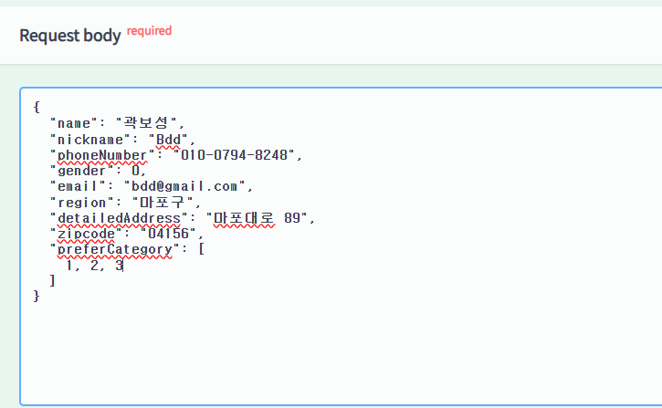
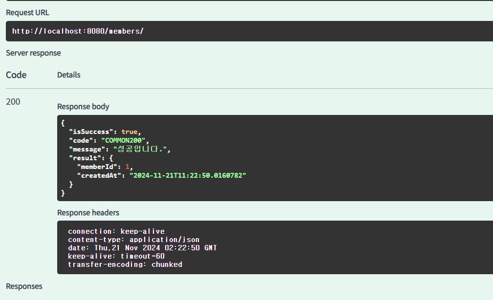

## 1. 특정 지역에 가게 추가하기 API
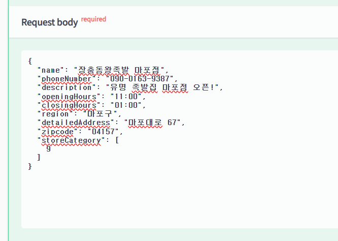
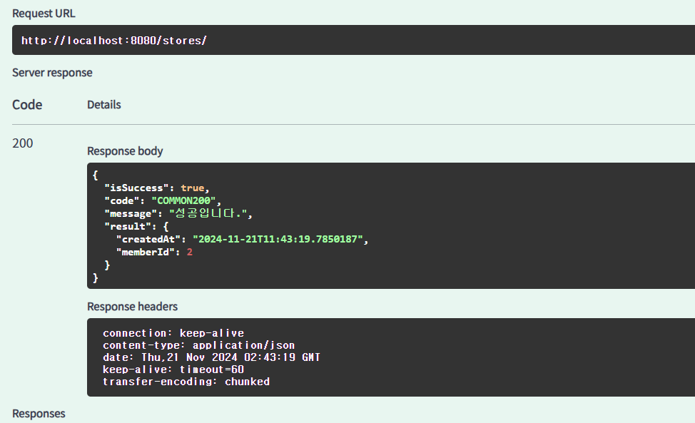

## 2.가게에 리뷰 추가하기 API
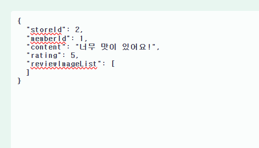
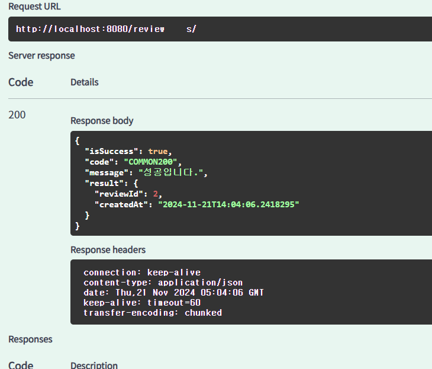

## 3. 가게에 미션 추가하기 API
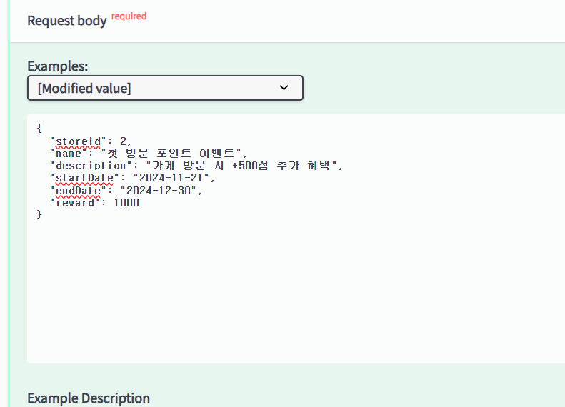
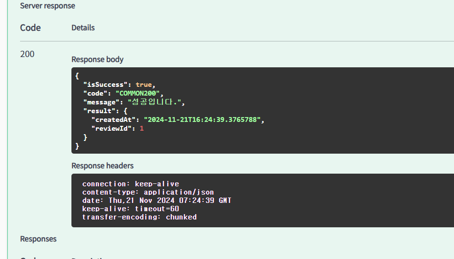

## 4.가게의 미션을 도전 중인 미션에 추가(미션 도전하기) API
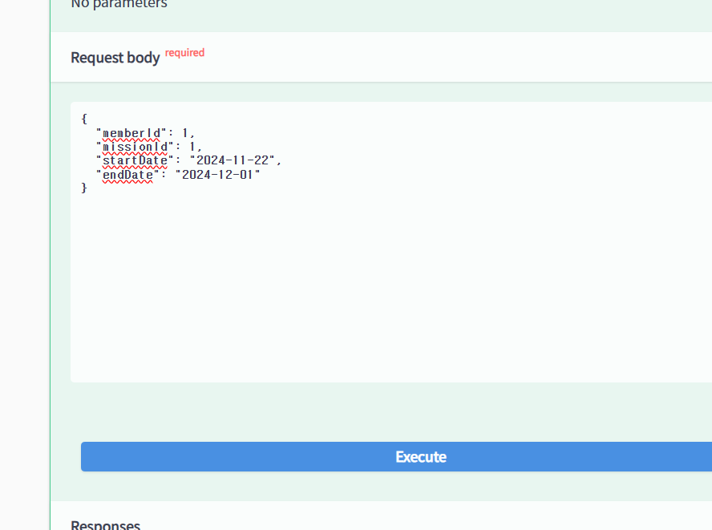
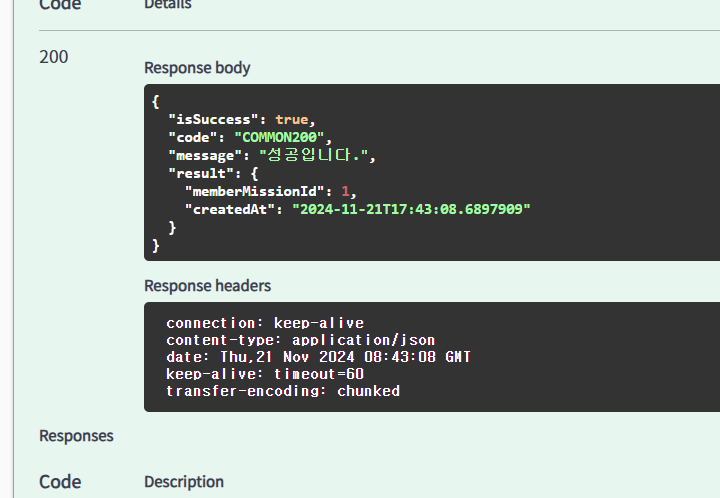
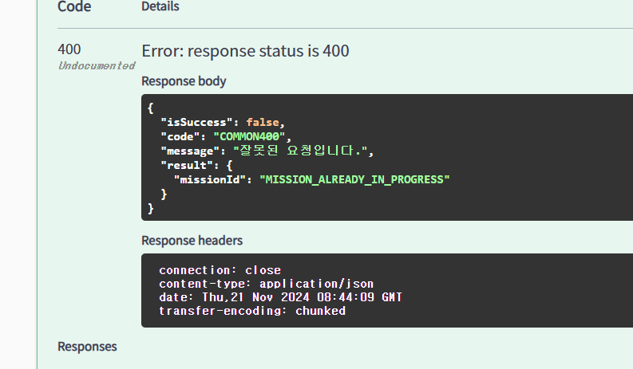
- 해당 사진은 잘못된 요청일때 반환되는 JSON을 출력했습니다.

## +미션.  Validator 리팩토링하기!
```java
//수정 전 코드
@Component
@RequiredArgsConstructor
public class CategoriesExistValidator implements ConstraintValidator<ExistCategories, List<Long>> {

    private final FoodCategoryRepository foodCategoryRepository;

    @Override
    public void initialize(ExistCategories constraintAnnotation) {
        ConstraintValidator.super.initialize(constraintAnnotation);
    }

    @Override
    public boolean isValid(List<Long> values, ConstraintValidatorContext context) {
        boolean isValid = values.stream()
                .allMatch(value -> foodCategoryRepository.existsById(value));

        if (!isValid) {
            context.disableDefaultConstraintViolation();
            context.buildConstraintViolationWithTemplate(ErrorStatus.FOOD_CATEGORY_NOT_FOUND.toString()).addConstraintViolation();
        }

        return isValid;

    }
}
```

- 해당 코드의 문제점: Service에서만 Repository 접근이 가능하도록 계층을 분리하였는데, 해당 코드는 Repository를 접근하여 분리 법칙에 위배됨.
- 해결책: 간접적으로 접근하도록 설정한다.
```java
//수정 후 코드
@Component
@RequiredArgsConstructor
public class CategoriesExistValidator implements ConstraintValidator<ExistCategories, List<Long>> {
    private final FoodCategoryService foodCategoryService; //서비스를 통해 리포지토리를 간접 접근하는 전략!

    @Override
    public void initialize(ExistCategories constraintAnnotation) {
        ConstraintValidator.super.initialize(constraintAnnotation);
    }

    @Override
    public boolean isValid(List<Long> values, ConstraintValidatorContext context) {
        //개선점: 리포지토리는 "반드시" 서비스단에서만 접근해야됨 -> 간접 접근으로 변경
        boolean isValid = foodCategoryService.allCategoriesExist(values);

        if (!isValid) {
            context.disableDefaultConstraintViolation();
            context.buildConstraintViolationWithTemplate(ErrorStatus.FOOD_CATEGORY_NOT_FOUND.toString()).addConstraintViolation();
        }

        return isValid;
    }
}
```