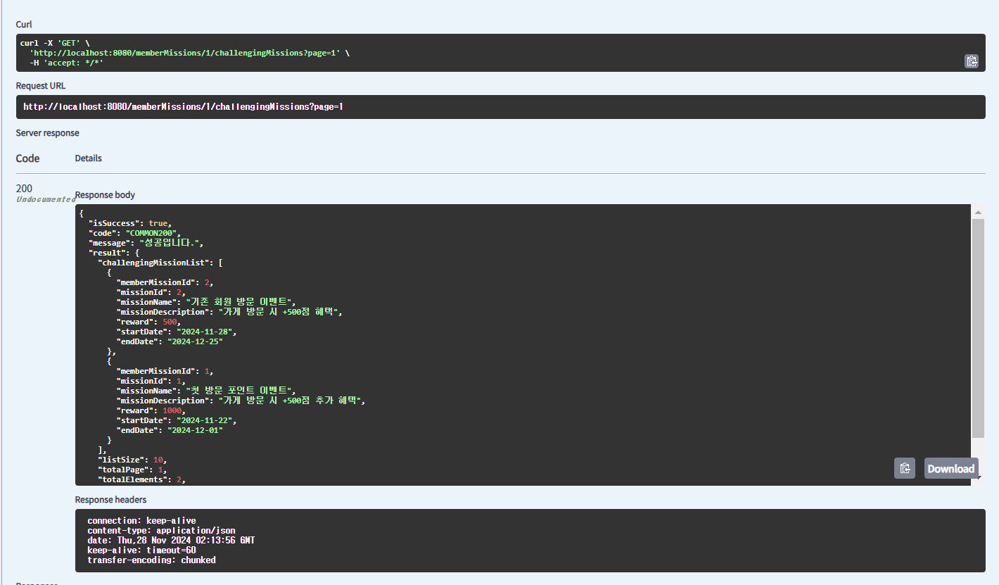
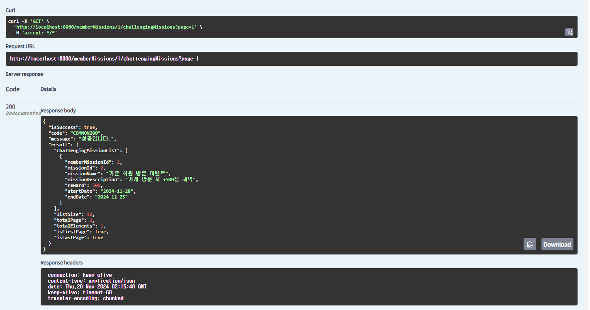

# 9주차 미션

## 1. 내가 작성한 리뷰 목록 조회

## 2. 특정 가게의 미션 목록 조회

## 3. 내가 진행중인 미션 목록 조회

## 4. 진행중인 미션 진행 완료로 바꾸기

- 아래의 스크린샷은 PATCH 이후 다시 내가 진행중인 미션목록을 확인하였을 때, 진행 완료되었는지 확인하는 스크린샷입니다.

### 추가적인 미션에 대한 고민?
- 4번 미션에서 `PATCH` 할 때, 동시에 해당 멤버의 ***포인트 추가를 반영***해야된다.
- `PATCH`시 `memberMissionId`로 서로 통신할지, 아니면 `memberId`와 `missionId`로 통신해야 할지는 고민되는 문제이다.